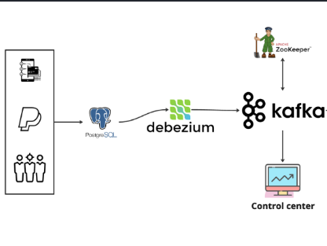

# Change data capture (CDC) with Debezium, Kafka, Postgres, Docker

## Introduction

This Python script acts as a data simulator, generating realistic but fictitious financial transactions and seamlessly integrating them into a PostgreSQL database. Users can leverage this tool to create a robust test environment for Change Data Capture (CDC) processes powered by Debezium. The script relies on the faker library to craft believable yet synthetic transaction data, which is then injected into a dedicated PostgreSQL table.

## System Architecture



## Technology:
 + **psycopg2**: A Python library that connects Python scripts to PostgreSQL databases.
 + **faker**: A Python library that generates fake data.
 + **PostgreSQL**: A relational database management system (RDBMS) that is scalable, reliable, and secure.
 + **Docker**: A containerization platform that allows developers to package applications and their dependencies into portable containers.
 + **Kafka**: A distributed streaming platform that is often used for event streaming and change data capture (CDC).
 + **Confluent Control Center**: A web-based tool for managing and monitoring Apache Kafka
 + **Debezium**: An open-source project that provides change data capture (CDC) for Apache Kafka.

## Getting Started

1. Download the code and set up Docker environment

- Clone this respository
    ```bash
    git clone https://github.com/hauct/de-cdc-project.git
    ``` 

- Open your Docker Desktop, build the containers
    ``` bash
    docker compose up -d
    ```

  Make sure these containers are running in your Docker

